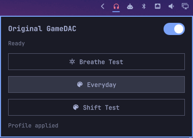

# GameDAC Controls for Omarchy

A thin Omarchy 4 shell adapter for the native Linux
[`gamedacctl`](https://github.com/AndreasDellrud/gamedacctl) lighting
controller. It shows whether the original GameDAC controller interface is
available and applies profiles saved by the native application. Profile-specific
emoji or glyph icons are shown when configured; profiles without one retain
effect-specific fallback icons. A master switch turns every headset lighting
zone off while preserving the selected profile, then restores that profile when
switched back on.



This is an unofficial, independent community project. It is not affiliated
with, endorsed by, or supported by SteelSeries or the Omarchy project. Product
and project names are used only to describe compatibility.

The plugin contains no HID, USB protocol, packet construction, privilege, or
firmware logic. It calls only the stable `gamedacctl status --json`,
`gamedacctl profile apply NAME --json`, and `gamedacctl profile lighting
on|off --json` interfaces. Status refreshes when the panel opens, on explicit
request, or when the atomically written profile store changes. Closing the
panel leaves no polling process behind.

## Requirements

- Omarchy 4
- `gamedacctl` 0.1.4 or newer and `gamedacctl-gui` available on the shell
  process `PATH`
- The scoped GameDAC udev rule supplied by `gamedacctl`

This adapter has the same deliberately narrow hardware boundary as the
controller: the original GameDAC USB control device `1038:1280` with the
original wired Arctis Pro. It does not add support for GameDAC Gen 2, Arctis
Nova, wireless base stations, audio processing, or firmware updates. See the
controller's [compatibility matrix](https://github.com/AndreasDellrud/gamedacctl/blob/main/docs/compatibility.md)
for details.

## Install

Install the current [`gamedacctl` Arch package](https://github.com/AndreasDellrud/gamedacctl/releases/tag/v0.1.4)
first and reconnect the GameDAC once so its scoped udev rule takes effect. Then
add and enable the plugin:

```bash
omarchy plugin add https://github.com/AndreasDellrud/omarchy-gamedacctl.git --enable
```

Left-click the headset icon to open the panel, middle-click to refresh, or
right-click to launch the full native controller. A missing or failing
controller is displayed as an error inside the panel and never invokes a shell
or privilege prompt.

Report GameDAC detection, lighting, or profile-storage problems in the
[`gamedacctl` issue tracker](https://github.com/AndreasDellrud/gamedacctl/issues).
Use this repository's issue tracker only for Omarchy panel rendering,
interaction, or plugin lifecycle problems.

## Development validation

```bash
omarchy plugin validate .
```

## License

The plugin is available under your choice of the [MIT License](LICENSE-MIT) or
the [Apache License 2.0](LICENSE-APACHE).
